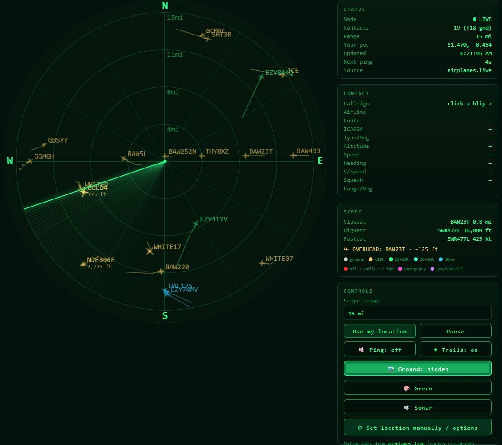

# R4D4RVU

**A classic round radar that sweeps the skies above you — from live community ADS-B data, a local SDR dongle, or an RTL-SDR / HackRF One plugged straight into your browser — plus a bonus in-browser HackRF receiver to listen to the pilots.**



R4D4RVU centers a vintage CRT-style radar scope on your location and plots every aircraft within range as a glowing blip — with a continuously rotating sweep, type-specific symbols, altitude colours, fading trails, a sonar ping, and a clickable contact readout that pulls airline, route, and a photo of the actual aircraft. It's a single self-contained `index.html`: no build step, no dependencies, no account.

> Inspired by [AnthonySturdy/micro-radar](https://github.com/AnthonySturdy/micro-radar).

**▶ Live demo:** https://raddad87.github.io/R4D4RVU/

---

## ✈️ Features

- **Authentic radar scope** — circular display, range rings, compass spokes, N/E/S/W cardinals, and a sweeping hand with a phosphor-style fading trail.
- **Your location, your sky** — uses the browser Geolocation API to center on you, or set coordinates manually.
- **Three data sources** — live [airplanes.live](https://airplanes.live) (no key), a **local SDR** feed (`dump1090-fa`/`readsb`) for fully offline use, or an **RTL-SDR or HackRF One plugged straight into the browser** over WebUSB.
- **Type-specific symbols** — winged jets, light triangles, helicopter rotors, drone diamonds, glider darts, and ground squares (from the ADS-B emitter category).
- **Altitude colours** — blips coloured by band (ground · <10k · 10–20k · 20–30k · 30k+) with a legend.
- **Threat & responder highlighting** — emergency squawks (7500/7600/7700) flash **pink**; **military, police, coast guard, fire, and medical** aircraft are **bright red** with a ring; **government / customs / border** are **purple**. Classification uses the ADS-B military flag plus the registered operator (via adsbdb) and an anchored-callsign pass.
- **Smooth motion & fading trails** — aircraft are dead-reckoned between updates so they glide and leave a continuous trail that holds to 25 miles, then fades out by 32.
- **Rich contact on click** — callsign, airline, origin → destination, ICAO24, type & registration, altitude, speed, heading, vertical speed, squawk, range/bearing, and a **photo** of the aircraft (planespotters).
- **Scope HUD** — live closest / highest / fastest, plus an "overhead" alert when a plane passes within 1.5 mi.
- **Sonar ping** — a classic submarine ping as the sweep crosses each contact, with selectable voices (Sonar / Sub / Blip / Soft).
- **Themes** — recolour the whole scope: Green, Amber, Ice, or Alert.
- **Shareable flight links** — copy a link that re-opens the radar locked onto the selected aircraft.
- **Track, hide-ground, range** — lock onto a plane (homing line + ring), hide parked traffic, and pick 15–300 mi.
- **Works on mobile** — responsive layout, finger-sized taps, the circle sized to your screen.
- **🎧 Airband listener (experimental)** — a companion page (`airband.html`) tunes your **HackRF One** to VHF airband and plays live **ATC voice** in the browser (AM demodulated in JS), preloaded with DCA / IAD / BWI tower, ground, clearance, approach &amp; departure frequencies.

---

## 🚀 Quick start

Open **https://raddad87.github.io/R4D4RVU/**, click **Use my location**, and allow the prompt. That's the whole setup.

Run it yourself:

```bash
python3 -m http.server 8000   # from the folder with index.html, then visit http://localhost:8000
```

### Deploy to GitHub Pages
The app is a single `index.html` at the repo root: **Settings → Pages → Deploy from a branch → `main` → `/ (root)`**.

---

## 🛰️ Data sources & going offline

Open **⚙ Set location manually / options → Data source**:

| Source | What it does |
| --- | --- |
| **Online — airplanes.live** | Default. Free community ADS-B over the internet, no key. |
| **Local SDR (offline)** | Reads a local `dump1090-fa`/`readsb` `aircraft.json` — fully offline. |
| **RTL-SDR (USB) — in browser** | Decodes a plugged-in RTL-SDR **in the browser** over WebUSB (Chrome/Edge desktop, experimental). |
| **HackRF One (USB) — in browser** | Tunes & decodes a plugged-in **HackRF One in the browser** over WebUSB (Chrome/Edge desktop). **Experimental & unverified** — may need gain tuning; if no contacts appear, use Local SDR mode instead. |

R4D4RVU originally targeted the OpenSky Network, but OpenSky's data endpoint only sends CORS headers for its own site, so no static page can read it. airplanes.live allows direct browser requests, which is why it's the default.

**Turn your dongle into a radar in one command** — the repo ships a Docker stack (readsb + a same-origin web server) and double-click launchers:

```bash
cp .env.example .env     # set your receiver LAT / LON
docker compose up -d     # or double-click start-radar.command / .bat / .sh
# open http://localhost:8078/
```

Thorough step-by-step instructions for every path — RTL-SDR (in-browser / Docker / existing decoder), **HackRF One** & PortaPack, antenna tips, driver setup (Zadig / `modprobe`), and troubleshooting — are in **[SDR-SETUP.md](SDR-SETUP.md)**. Local SDR mode works with **any** decoder that outputs `aircraft.json` — RTL-SDR, **HackRF One** (e.g. dump1090_sdrplus or readsb+SoapyHackRF), Airspy, SDRplay, and more. A PortaPack **H4M** running Mayhem decodes on-device; to feed the radar, connect its HackRF to a computer and run a host decoder.

### Run it fully offline / from an SSD

The in-browser decoder's libraries are **vendored in the repo** (`rtlsdr.bundle.js`, `mode-s-demodulator.bundle.js`) — so both the **RTL-SDR** and the experimental **HackRF One** WebUSB paths decode your device with **no internet**. Copy the folder to a USB stick or SSD, double-click **`serve-offline.command` / `.bat` / `.sh`** (it serves over `http://localhost` — which WebUSB requires — using Python or Node), plug in the dongle, and pick **RTL-SDR (USB)** or **Local SDR**. Everything on the scope works offline; only the airline/route/photo lookups need a connection. See **Path F** in [SDR-SETUP.md](SDR-SETUP.md).

---

## 🎧 Listen to ATC voice (airband)

Want to hear the pilots and controllers, not just watch the blips? The repo ships an experimental **in-browser HackRF airband receiver** — **[airband.html](airband.html)** ([live](https://raddad87.github.io/R4D4RVU/airband.html)), also linked from the radar's ⚙ options.

It tunes your **HackRF One** to a VHF airband channel (118–137 MHz, with a 250 kHz digital IF to dodge the DC spur), mixes it to baseband, low-pass-decimates 2 MS/s down to 10 kHz audio, **AM-demodulates** it, and plays it through your speakers — all over WebUSB, **nothing installed**. Squelch, volume, a signal meter, ± fine-tuning, and manual frequency entry are built in. It comes preloaded with **DCA, IAD, and BWI** tower / ground / clearance / approach / departure / ATIS frequencies.

> Desktop Chrome/Edge only · listens to **one frequency at a time** · the HackRF can only be claimed by one page at a time, so **stop the radar's HackRF feed before starting the airband listener**. It's **experimental** (CPU-heavy JS AM demod, basic adjacent-channel rejection). Listening to ATC is legal in the US; transmitting is not.

## 🎛️ Controls

| Control | What it does |
| --- | --- |
| **Scope range** | Radar radius, 15–300 miles. |
| **Use my location** | Re-centers the scope on your GPS/geolocation. |
| **Pause / Resume** | Freezes the sweep and polling. |
| **Ping** | Sonar beep as the sweep passes a contact. Tap the sound name to change voice. |
| **Trails** | Toggle the fading position trails. |
| **Ground** | Show or hide aircraft on the ground (hidden by default). |
| **Theme** | Cycle Green → Amber → Ice → Alert. |
| **Track this aircraft** | Lock onto the selected plane — homing line, pulsing ring, pinned details. |
| **Share** | Copy a link that re-opens the radar tracking that flight. |
| **Click a blip** | Opens the Contact readout (airline, route, photo, and more). |

---

## 🧭 How it works

- **Distance** uses the haversine formula on the WGS-84 sphere; **bearing** uses the great-circle initial-bearing formula (0° = North, clockwise). Everything is shown in **miles**.
- A blip sits at `distance / range` of the scope radius, rotated to its bearing — north is up.
- Between data refreshes each airborne plane is **dead-reckoned** from its speed and heading, then corrected on the next update — so motion is smooth and trails are continuous.
- Brightness tracks how recently the sweep passed each blip's bearing, mimicking a phosphor tube.
- Altitude in feet, speed in knots, vertical rate in feet/min come straight from the ADS-B feed.

## 🛠️ Configuration

Near the top of the `<script>` in `index.html`:

```js
const CFG = {
  dataUrl: "https://api.airplanes.live/v2/point/",
  refreshMs: 12000,      // online refresh interval
  sweepPeriodMs: 4000,   // one sweep revolution
  trailFade: 25,         // miles before a trail starts fading
  trailMax: 32,          // miles where it disappears
};
```

---

## 📦 Project structure

```
R4D4RVU/
├── index.html                  # the entire app (HTML + CSS + JS)
├── rtlsdr-webusb.js            # in-browser WebUSB decoder (RTL-SDR + experimental HackRF)
├── airband.html                # experimental in-browser HackRF airband (ATC voice) listener
├── rtlsdr.bundle.js            # vendored RTL-SDR driver (offline, no CDN)
├── mode-s-demodulator.bundle.js# vendored ADS-B demodulator (offline)
├── docker-compose.yml          # one-command readsb + radar stack
├── nginx.conf                  # serves the app + same-origin feed proxy
├── .env.example                # receiver location / tuner settings
├── start-radar.command/.sh/.bat# double-click launchers (Docker stack)
├── serve-offline.command/.sh/.bat # local static server for offline/SSD use
├── install-on-dump1090fa.sh    # installer for existing decoders
├── SDR-SETUP.md                # full SDR + offline setup guide
├── screenshot-radar.jpg        # screenshot
├── README.md                   # this file
└── LICENSE                     # MIT
```

---

## ⚖️ Disclaimer

Positions are approximate, can be delayed, and depend on community ADS-B coverage. **R4D4RVU is for hobby and educational use only — never for navigation or any safety-critical purpose.**

## 🙏 Credits

Live data © [airplanes.live](https://airplanes.live) contributors · routes/owners via [adsbdb](https://www.adsbdb.com) · photos via [planespotters.net](https://www.planespotters.net) · in-browser SDR uses [rtlsdrjs](https://github.com/sandeepmistry/rtlsdrjs) (Apache-2.0) and [mode-s-demodulator](https://github.com/watson/mode-s-demodulator) (MIT); the experimental HackRF WebUSB paths follow the [libhackrf](https://github.com/greatscottgadgets/hackrf) / [hackrf.js](https://github.com/mildsunrise/hackrf.js) (MIT) protocol; airband frequencies via [OurAirports](https://ourairports.com).

## 📄 License

[MIT](LICENSE) — do what you like, no warranty.
